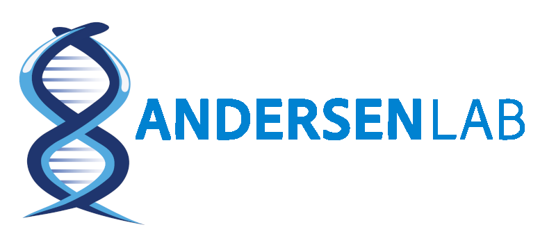
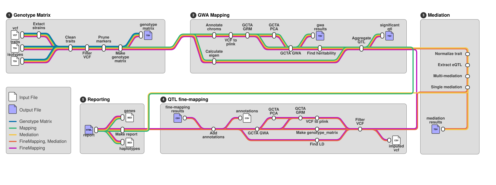

<h1>
  <picture>
    <source media="(prefers-color-scheme: dark)" srcset="docs/images/logo_light_small.png">
    
  </picture>
</h1>

## Introduction

**andersenlab/nemascan-nf** is a bioinformatics pipeline that can be used to perform genome-wise association mapping in *Caenorhabditis* species. It takes a at minimum a VCF file with SNV data for multiple worm stains and a tsv file with phenotype data for one or more traits as input, creates a genotype matrix and can perform genome-wide mapping, fine-mapping on significant QTL, mediation with transcript eQTL, and produces an interactive report per trait.



1. Pull strains present in VCF file (`zcat`, `awk`)
2. Adjust and filter trait strains and collapse replicates (`awk`)
3. Filter VCF by strain list and non-missing SNVs ([`bcftools`](https://samtools.github.io/bcftools/bcftools.html))
4. Prune markers by LD for a subset for whole genome mapping ([`plink`](https://www.cog-genomics.org/plink/1.9/))
5. Create a text-based genotype matrix ([`bcftools`](https://samtools.github.io/bcftools/bcftools.html), `sed`)
6. Create a name to numner mapping of chromosomes (`zcat`, `awk`)
7. Convert filtered VCF file to plink format ([`plink`](https://www.cog-genomics.org/plink/1.9/))
8. Create a genetic relatedness matrix (GRM) ([`plink`](https://www.cog-genomics.org/plink/1.9/))
9. Find PCA-based covariates (optional) ([`plink`](https://www.cog-genomics.org/plink/1.9/))
10. Perform genome-wide association mapping ([`plink`](https://www.cog-genomics.org/plink/1.9/))
11. Fine narrow-sense heritability ([`R`](https://www.r-project.org/), [`R-sommer`](https://cran.r-project.org/web/packages/sommer/index.html))
12. Find eigen-based effective number of tests for p-value correction ([`python`](https://www.python.org/))
13. Normalize trait phenotype values (`awk`)
14. Extract eQTL falling in the significant QTL intervals (`awk`)
15. Calculate multi-mediation values and significant genes ([`R`](https://www.r-project.org/), [`R-Multimed`](https://www.rdocumentation.org/packages/mediation/versions/4.5.1))
16. Calculate mediation values for each significant gene ([`R`](https://www.r-project.org/), [`R-Multimed`](https://www.rdocumentation.org/packages/mediation/versions/4.5.1))
17. Filter imputed VCF by strain list, significant QTL interval, and non-missing SNVs ([`bcftools`](https://samtools.github.io/bcftools/bcftools.html))
18. Convert filtered VCF file to plink format ([`plink`](https://www.cog-genomics.org/plink/1.9/))
19. Create a complete genetic relatedness matrix (GRM) ([`plink`](https://www.cog-genomics.org/plink/1.9/))
20. Find PCA-based covariates (optional) ([`plink`](https://www.cog-genomics.org/plink/1.9/))
21. Perform genome-wide association mapping ([`plink`](https://www.cog-genomics.org/plink/1.9/))
22. Create a text-based QTL interval genotype matrix ([`bcftools`](https://samtools.github.io/bcftools/bcftools.html), `sed`)
23. Find linkage disequilibrium between significant QTL peak and surrounding markers ([`bcftools`](https://samtools.github.io/bcftools/bcftools.html))
24. Append variant impact data (optional) and LD values to each marker in fine-mapping output ([`python`](https://www.python.org/))
25. Create HTML-based report ([`python`](https://www.python.org/), `javascript`, [`DataTables`](https://datatables.net/), [`plotly`](https://plotly.com/javascript/))

## Usage

### Inputs

> [!NOTE]
> If you are new to Nextflow, please refer to [this page](https://nf-co.re/docs/get_started/environment_setup/overview) on how to set-up Nextflow. Make sure to [test your setup](https://nf-co.re/docs/get_started/run-your-first-pipeline) with `-profile test` before running the workflow on actual data.

> [!NOTE]
> For the Andersen Lab, Rockfish-specific paramaterization is enabled by default. If this is your first time running a Nextflow pipeline, make sure to follow [this guide](https://andersenlab.org/dry-guide/latest/rockfish/rf-nextflow/#configuring_nextflow) to set up your environment and activate the appropriate conda environment (e.g. nf26) before running.

> [!NOTE]
> This workflow requires Nextflow version 26 or greater.

You will need several input files with some specific to the modules you choose to run.

**VCF file** (--vcf):

You will need a VCF file containing genotypes for all samples. Included samples should be genetically distinct (i.e. one sample per isotype group). The VCF file should be in plain-text or gzipped format, not a BCF.

**Trait file** (--traits):

You will need a tab-separated file with following format:

| strain | trait1 | trait2 |
| ------ | ------ | ------ |
| AB1    | 0.123  | 1.532  |
| N2     | 1.765  | 2.657  |

The file must have a header starting with "strain" and every subsequent column heading corresponding to a trait name.Each row represents single sample. The first column contains the strain name while the remaining columns contain phenotype values for each trait.

**Isotypes file** (--isogroups, optional):

This file is a tab-separated file with strain names, their isotype reference strain, and alternative strain names. If the species being mapped is *C. elegans*, *C. briggsae*, or *C. tropicalis* and the species is specified, this data will automatically be downloaded from [CaeNDR](https://caendr.org/request-strains/isotype_list) if no isotype file is passed. Otherwise, no adjustments or filtering or strains will occur based on isotype data.

This file needs to be in the following format:

| strain | isotype | previous_names |
| ------ | ------- | -------------- |
| AB1    | AB1     |                |
| ECA153 | N2      | N2_(CGC)\|N2   |

Multiple alternative names can be specified using a "|" as a separator. Alternative names do not need to specified for each strain.

**Imputed VCF file** (--imputed, optional, fine-mapping only):

For fine-mapping, you will want a VCF file with missing genotypes imputed to maximize the number of usable markers for association mapping. If an imputed VCF file is not specified, the orginal input VCF will be used. The VCF file should be in plain-text or gzipped format, not a BCF.

**Annotation file** (--annotation, optional, fine-mapping only):

To assess the functional impacts of each variant, you can pass a tab-separated file detailing the impact of each variant. The format of this file is expected to match one produced for CaeNDR using the tool CSQ, VEP, Annovar, or SnpEff. You can read more about them [here](https://caendr.org/faq#tool-differences). If you want to using this, we suggest downloading the annotations from [CaeNDR](https://caendr.org/data/data-release). 

**Haplotype file** (--haplotypes, optional, fine-mapping only):

To view whether variant differences are driven by broader genetic stratification, you can pass a bed file containing strain haplotypes for plotting in the final trait reports. This file should be a bed file containing the chromosome, start position, end position, strain name, haplotype name, two columns that are not used by this pipeline, and a haplotype color. Each line represents one haplotype block in a single strain. If the species being mapped is *C. elegans*, *C. briggsae*, or *C. tropicalis* and the species is specified, this data will automatically be downloaded from [CaeNDR](https://caendr.org/data/data-release) if no haplotype file is passed.

**Gene file** (--genes, optional, fine-mapping only):

This is a bed12 file with transcript modesl used to plot genes on the variant annotation plot. If the species being mapped is *C. elegans*, *C. briggsae*, or *C. tropicalis* and the species is specified, this data will automatically be downloaded from [CaeNDR](https://caendr.org/data/data-release) if no haplotype file is passed.

### Parameters

**-output-dir** (default: nemascan_<datetime: yyyy-MM-dd_HH-mm-ss>)

The output directory to save results files in. Note that this uses a single hyphen to specify the option rather than a double-hyphen as it is a general Nextflow parameter, not a workflow-specific parameter.

**--gwa_method** (default: both)

The genetic structure correction approach to use. This can be inbred, loco (for leave on chromosome out), or both to run both versions of the association mapping.

**--species** (default: null)

The species that the input data are from. This is only used for accessing species-specific data from [CaeNDR](https://caendr.org/) if the species is *C. elegans*, *C. briggsae*, or *C. tropicalis*.

**--mapping** (default: true)

A true/false value for whether to run GWA mapping. This is required for running fine-mapping, mediation, and report creation.

**--finemapping** (default: true)

A true/false value for whether to run fine-mapping on any significant QTL found by GWA.

**--mediation** (default: false)

A true/false value for whether to run eQTL mediation on any significant QTL found by GWA. If true, then the species must be *C. elegans* for existing eQTL data from [Zhang *et al.*](http://dx.doi.org/10.1038/s41467-022-31208-4) to be used or eQTL and transcription files must be passed using --transcript eqtl <EQTL> and --transcript_expression <EXPRESSION>, respectively.

**--skip_report** (default: false)

A true/false value for whether to generate an html report for each trait tested. All other output files are still generated. This option can be used to save on storage space if a large number of traits are being tested. 

**--pca** (default: false)

A true/false value for whether whether to use the first principal component as a covariate for association mapping. This can help with batch correction and systematic bias. 

**--skip_pruning** (default: false)

A true/false value for whether to skip outlier removal for phenotype values. 

**--summarization_method** (default: median)

The method to use for collapsing replicate values in the phenotype trait values. This can be either median or mean.

**--maf** (default: 0.05)

The minor allele frequency cutoff. Only alleles with at least this frequency are considered when constructing the genetic relateness matrix.

**--significance_threshold** (default: BF)

This is either the method to use for correcting for multiple testing, either BF (Bonferonni) or EIGEN (using the correction strategy detailed [here](https://www.nature.com/articles/6800717)), or a user-defined p-value cutoff. If a cutoff value is passed, no multiple testing correction is applied.

**--alpha** (default: 0.05)

The significance cutoff value to use. This value is modified by multiple testing correction based on the number of tests (BF) or effective number of tests (EIGEN) performed.

**--snp_grouping** (default: 1000)

The window of tested SNVs to use for collapsing multiple significant QTL into a single interval. 

**--ci_size** (default: 150)

The number of SNVs to extend the significant QTL interval by in each direction.

**--sparse_cut** (default: 0.05)

The relatedness cutoff value for generating a sparse genetic related map. This is only used if using the inbred method for handling genetic structure.

**--highlight_strains** (default: null)

A comma-separated list of strains to highlight in the phenotype by genotype plots.

### Running the pipeline

Now, you can run the pipeline using:

```bash
nextflow run andersenlab/nemascan-nf \
    --vcf <VCF> \
    --trait <TRAIT TSV> \
    --species <SPECIES NAME> \
    -profile <docker/singularity/.../institute> \
    -output-dir <OUTDIR>
```

For running this pipeline on the Rockfish cluster, no profile is needed to run with containers and slurm support.

## Pipeline output

This pipeline produces several output files, some of which are module-specific (e.g. mapping, fine-mapping, mediation).

### Genotype Matrix

Regardless of which parts of the pipeline are run, a genotype matrix will be produced. A strain issues file is also produced, detailing strain name changes and rejected strains. 

### GWA Mapping

If genome-wide association mapping is performed, a gwa report from GCTA is produced for each combination of traits and method(s) used (inbred, loco, or both). A tsv file containing significant QTL and their associated genomic interval is produced for each pair of trait and method. A file containing the narrow-sense heritability of each trait is produced with one line per trait. Finally, a file containing the number of independent tests as calculated using the eigen method is also produced.

### Fine-Mapping

For each significant QTL found in each method, a fine-mapping association file is produced. This is the standard GCTA output appended with linkage disequilibrium values between the peak QTL and all other markers in the interval and, if an variant annotation file is passed, 4 additional columns are added: wormbase gene name, gene name, inferred consequence, and amino acid change. 

### Mediation

For each trait, a multi-mediation results file is produced looking at all eQTL within the QTL interval. If any genes are determined to be significant, a single-mediation file is produced with results from mediation testing of each of the significant genes.

### GWA Report

If a GWA report is not skipped, an HTML report for each trait is produced summarizing all of the above outputs with interactive plots and tables.

### Output directory structure

```
<OUTPUT_DIR>/
├─ <TRAIT_1>/
│  ├─ fine_mapping/ (if fine-mapping run)
│  │  └─ <METHOD>/
│  │     ├─ <QTL_1>/
│  │     │  └─ <TRAIT_1>_<METHOD>_<QTL_1>.annotated.gwa
│  │     │
│  │     ├─ <QTL_2>/
│  │     │  └─ <TRAIT_1>_<METHOD>_<QTL_2>.annotated.gwa
│  │     ...
│  │
│  ├─ gwa/  (if mapping run)
│  │  └─ <METHOD>/
│  │     ├─ <TRAIT_1>_<METHOD>.gwa
│  │     └─ <TRAIT_1>_<METHOD>_qtl.tsv
│  │
│  ├─ mediation/  (if mediation run)
│  │  └─ <METHOD>/
│  │     ├─ <QTL_1>/
│  │     │  ├─ <TRAIT_1>_<METHOD>_<QTL_1>_medmulti.tsv
│  │     │  └─ <TRAIT_1>_<METHOD>_<QTL_1>_med.tsv
│  │     ...
│  │
│  └─ report/  (if report run)
│     └─ <TRAIT_1>_report.html
│ 
├─ <TRAIT_2>/
│  ├─ fine_mapping/  (if fine-mapping run)
│  │
│  ...
│ 
...
│ 
├─ independent_tests.txt  (if mapping run)
├─ strain_issues.txt
├─ trait_heritability.tsv  (if mapping run)
└─ versions.txt
```

## Citation

If you use andersenlab/nemascan-nf for your analysis, please cite it using the following doi: [10.1093/g3journal/jkac114](https://doi.org/10.1093/g3journal/jkac114)

> Widmayer SJ, Evans KS, Zdraljevic S, Andersen EC. Evaluating the power and limitations of genome-wide association studies in *Caenorhabditis elegans*. *G3* (Bethesda). 2022 Jul 6;12(7):jkac114. doi: 10.1093/g3journal/jkac114. PMID: 35536194; PMCID: PMC9258552.